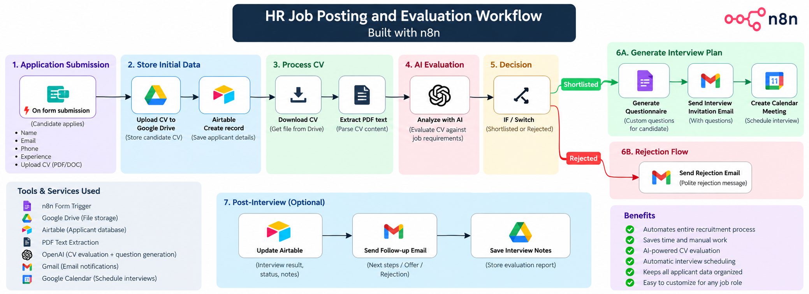

# HR Job Posting and Evaluation with AI

An **n8n-based AI recruitment automation workflow** that collects job applications, stores CVs, evaluates candidates against a job description, shortlists or rejects candidates, generates follow-up questionnaires, sends personalized interview emails, schedules a Google Calendar meeting, and stores screening questions in Airtable.

> The imported workflow is named **`HR Job Posting and Evaluation with AI`** and is tagged `HR`.

## Workflow Overview



> **Diagram note:** The image is a high-level project overview. The current imported JSON implements the rejection branch as an Airtable status update only. A rejection email and post-interview automation can be added later as extensions.

## What the Workflow Does

1. **Collects candidate applications** through an n8n form.
2. **Uploads the candidate CV** to Google Drive.
3. **Creates an applicant record** in Airtable.
4. **Downloads and extracts text from the PDF CV**.
5. **Uses OpenAI to compare the CV with the job description**.
6. **Returns a score from 0 to 1** plus a short reason.
7. **Shortlists candidates scoring `>= 0.7`**.
8. **Updates rejected candidates** in Airtable with `No hire` status.
9. **Generates five candidate-specific questionnaire questions** for shortlisted applicants.
10. **Stores questionnaire responses** in Airtable.
11. **Generates a personalized interview email** using the candidate CV, questionnaire responses, and job posting data.
12. **Sends the email through SMTP**.
13. **Uses OpenAI + Google Calendar** to schedule a 30-minute interview.
14. **Stores the interview time** in Airtable.
15. **Generates phone-screening questions** and stores them in Airtable.

## Actual n8n Flow

```text
On form submission
        |
        v
Upload CV to Google Drive
        |
        v
Applicant Details
        |
        v
Airtable - Create Applicant
        |
        v
Download CV
        |
        v
Extract PDF Text
        |
        v
AI Agent - CV vs Job Description
        |
        v
Shortlisted?  (score >= 0.7)
      /   \
     /     \
  Yes       No
   |         |
   v         v
Potential   Rejected
Hire        Airtable Update
   |
   v
Generate Questionnaires
   |
   v
Questionnaire Form
   |
   v
Update Questionnaire Responses in Airtable
   |
   v
Personalize Email
   |
   v
Send Email
   |
   v
Book Meeting + Google Calendar
   |
   v
Update Phone Meeting Time in Airtable
   |
   v
Generate Screening Questions
   |
   v
Store Screening Questions in Airtable
```

## Integrations

| Service | Purpose |
|---|---|
| **n8n Form** | Candidate application and questionnaire forms |
| **Google Drive** | CV upload and download |
| **Airtable** | Applicant database, job posting lookup, evaluation results, responses, interview time, screening questions |
| **OpenAI** | CV evaluation, questionnaire generation, personalized email, meeting planning, screening questions |
| **SMTP** | Sending candidate email |
| **Google Calendar** | Creating the interview event |

## Required Credentials

Create these credentials in n8n before running the workflow:

### 1. Google Drive OAuth2

- Enable **Google Drive API** in Google Cloud.
- Create a Google OAuth Web Application.
- Add the OAuth redirect URL shown by n8n.
- Connect your Google account.
- Select your own CV upload folder in the workflow.

### 2. Airtable Personal Access Token

Required scopes:

```text
data.records:read
data.records:write
schema.bases:read
```

Grant the token access to the Airtable base used by this project.

### 3. OpenAI API

Add an OpenAI API credential and assign it to all OpenAI/AI nodes.

The imported workflow currently references models including:

```text
gpt-4o-mini
gpt-4o
```

You can replace these with models available to your OpenAI account.

### 4. SMTP

For Gmail SMTP:

```text
Host: smtp.gmail.com
Port: 465
SSL/TLS: On
User: your Gmail address
Password: Google App Password
```

Do not use your normal Google account password.

### 5. Google Calendar OAuth2

- Enable **Google Calendar API** in Google Cloud.
- You can reuse the same Google OAuth client used for Google Drive if the redirect URI is the same.
- Connect the Google Calendar account you want to use for interviews.

## Airtable Setup

The workflow was built around an Airtable base named **Simple applicant tracker** with at least these tables:

```text
Applicants
Positions
```

The workflow uses applicant fields such as:

```text
Name
Email address
Phone
Stage
Applying for
CV Link
JD CV score
CV Score Notes
Questonnaires and responses
Phone interview
Phne interview screening questions
```

> The last two field names above reflect the spelling used in the imported workflow. If you rename them in Airtable, update the corresponding n8n nodes as well.

The `Positions` table is used by Airtable Tool nodes to retrieve the job posting/job description for AI evaluation and generation tasks.

## Application Form

The imported form is configured for an **Automation Specialist** position and asks for:

```text
First Name
Last Name
Email
Phone
Years of experience
Upload your CV (.pdf)
```

The default form path is:

```text
automation-specialist-application
```

Before publishing, replace the form description with the job description you are actually hiring for.

## Important Configuration Changes After Import

This workflow came from another n8n environment. **Do not run it unchanged.** Review every integration node and replace the original environment values.

### Google Drive

The imported JSON references an original folder named:

```text
HR Test
```

Change the **Upload CV to google drive** node to your own folder, for example:

```text
n8n CV Uploads
```

If the folder does not appear in the list, use **By ID** and paste the Google Drive folder ID.

### Airtable

Open every Airtable/Airtable Tool node and select:

- your Airtable credential
- your Airtable base
- the correct `Applicants` or `Positions` table
- the correct field mappings

Nodes to review include:

```text
Airtable
Airtable1
Airtable2
Rejected
Potential Hire
update questionnaires
job_posting
candidate_insights
update phone meeting time
job_posting1
candidate_insights1
screening questions
```

### OpenAI

Assign your OpenAI credential to:

```text
OpenAI Chat Model
AI Agent
generate questionnaires
Personalize email
Book Meeting
Screening Questions
```

Review the prompts and model selections before production use.

### Email

The imported workflow contains a sender email from the original creator. Open **Send Email** and replace the `From Email` value with the address authorized by your SMTP account.

Also review the **Personalize email** prompt because its default signature contains a creator-specific name.

### Google Calendar

Open the **Google Calendar** tool node and replace the original calendar with your own calendar.

The meeting prompt currently asks for a **30-minute slot on the next day between 8:00 AM and 5:00 PM**.

### Timezone

The imported workflow timezone is:

```text
Africa/Nairobi
```

Change it in **Workflow Settings** to your desired timezone before using calendar automation.

## How to Import

1. Open n8n.
2. Create/open a workflow.
3. Open the workflow menu.
4. Choose **Import from File**.
5. Select:

```text
HR Job Posting and Evaluation with AI.json
```

6. Replace all imported credentials and resource selections.
7. Save the workflow.

## Running n8n Locally

Start n8n:

```bash
npx n8n
```

Open:

```text
http://localhost:5678
```

If external services need to reach your local n8n instance, you can expose it temporarily with Cloudflare Tunnel:

```bash
npx cloudflared tunnel --url http://localhost:5678
```

For production use, prefer a permanent hostname/named tunnel instead of a temporary `trycloudflare.com` URL.

## Testing the Workflow

1. Keep n8n running.
2. Click **Execute workflow**.
3. Open the test URL for **On form submission**.
4. Submit one test candidate with a PDF CV.
5. Watch each node execute.
6. A green node indicates success.
7. Click any red node to inspect the error.
8. Verify the following before publishing:
   - CV appears in your Google Drive folder.
   - Applicant is created in Airtable.
   - CV text is extracted.
   - AI score and reason are generated.
   - Shortlist/reject logic works at the `0.7` threshold.
   - Questionnaire responses are stored.
   - Email sends from your account.
   - Calendar event is created in your calendar.
   - Interview time and screening questions are saved in Airtable.
9. Publish only after the complete test succeeds.

## Common Errors

### Google Drive `403`

Check that:

- Google Drive API is enabled.
- The correct OAuth credential is connected.
- The workflow uses a folder owned/accessible by your account.
- Old folder IDs from the imported workflow have been replaced.

### Airtable `403 - INVALID_PERMISSIONS_OR_MODEL_NOT_FOUND`

Check that the Personal Access Token has:

```text
data.records:read
data.records:write
schema.bases:read
```

Also confirm the token has access to the selected Airtable base and that your Airtable user can create/update records.

### OAuth `403 access_denied`

If your Google OAuth app is in Testing mode, add the Google account you are signing in with under **Google Auth Platform -> Audience -> Test users**.

## Security Notes

- Never commit API keys, OAuth secrets, SMTP passwords, or Airtable Personal Access Tokens to GitHub.
- n8n credentials should stay inside n8n's credential manager.
- Review the imported workflow for creator-specific emails, calendar IDs, folder IDs, base IDs, prompts, and signatures.
- Use test data before processing real candidate information.
- Candidate CVs and applicant data can contain sensitive personal information; configure access and retention appropriately.

## Suggested Repository Structure

```text
.
├── README.md
├── workflow-overview.png
└── HR Job Posting and Evaluation with AI.json
```

## Customization Ideas

- Add a rejection email branch.
- Add recruiter approval before scheduling interviews.
- Add Slack/Teams notifications for shortlisted candidates.
- Replace the fixed `0.7` threshold with a configurable value.
- Add duplicate-applicant detection.
- Add structured audit logs and error handling.
- Add post-interview scoring and final hiring decision automation.
- Use a permanent Cloudflare domain or deploy n8n to a server for production.

## Disclaimer

AI-generated candidate scores and screening questions should be treated as **decision-support tools**, not as the sole basis for employment decisions. Human review should remain part of the hiring process.
